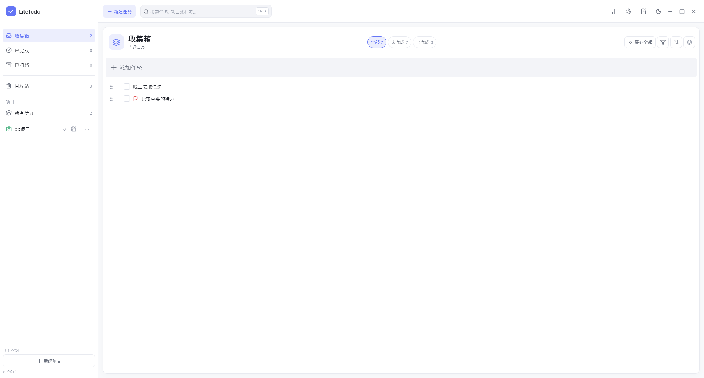
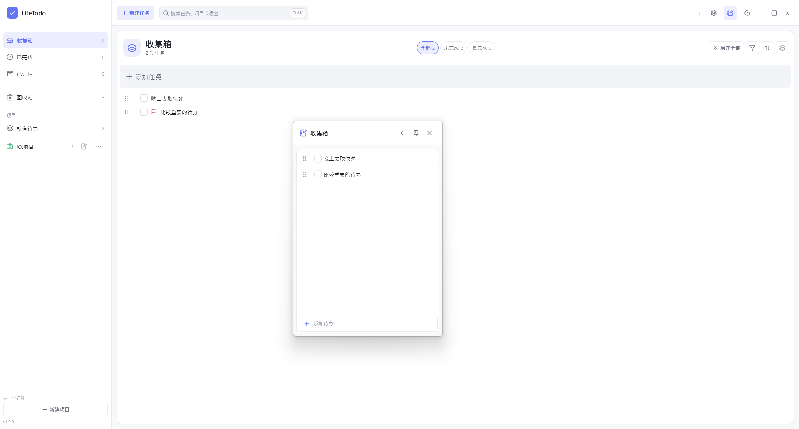
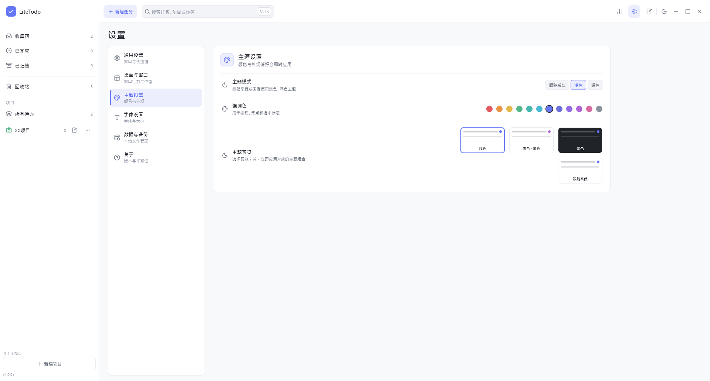

# LiteTodo

### 简单、轻量、本地优先的 Windows 桌面待办工具

**把复杂的事情拆简单，把所有待办留在自己的电脑里。**

项目管理 · 多级子任务 · QuickAdd · 紧凑模式 · 本地存储 · 数据备份


------

## ✨ 关于 LiteTodo

LiteTodo 是一款为 **Windows 桌面**设计的本地待办工具。

它没有账号体系，没有云同步，也不需要连接服务器。

你可以把任务按照 **项目 → Todo → 子任务** 的方式逐层拆解，用树形结构整理学习计划、工作任务、个人项目以及生活中的各种事情。

所有数据默认保存在你的电脑中。

> **LiteTodo 想做的不是另一个复杂的任务管理平台，而是一款打开就能用、用完不会打扰你的桌面工具。**

------

## 📸 界面预览







------

## 🌟 为什么是 LiteTodo？

很多待办工具最终都会慢慢变成：

账号、团队、订阅、云同步、日历、聊天、AI、消息中心……

然后一个本来只想记下「明天交作业」的人，莫名其妙拥有了一整套企业协作系统。

LiteTodo 选择另一条路。

### 🌲 用树形结构拆解任务

一件复杂的事情通常不是一个 Todo。

在 LiteTodo 中，每个任务都可以继续创建子任务，最多支持 **6 层任务结构**。

```text
完成新版本发布
├─ 完成首页
│  ├─ 调整任务列表
│  └─ 优化空状态
├─ 完成设置页面
│  ├─ 主题设置
│  └─ 字体设置
└─ 发布
   ├─ Release Build
   └─ GitHub Release
```

不用把所有事情挤在一条长长的清单里。

------

### ⚡ QuickAdd，想到就记

临时想到一件事情时，不需要完整打开主窗口。

使用 **QuickAdd** 可以快速记录任务：

```text
按下快捷键
↓
输入任务
↓
Enter
↓
继续原来的工作
```

减少一次记录待办对当前工作的打断。

------

### 🪟 为桌面使用而设计

LiteTodo 不是网页套壳式的任务列表，而是围绕 Windows 桌面使用场景设计。

支持：

- Full 完整模式
- Compact 紧凑模式
- QuickAdd 快速添加模式
- 窗口置顶
- 系统托盘
- 全局快捷键
- 开机启动

你可以让它成为一个普通应用，也可以让它安静地待在桌面边缘。

------

### 🔒 Local First

LiteTodo 默认不会把你的任务发送到任何服务器。

```text
你的任务
   ↓
LiteTodo
   ↓
本地 JSON 文件
```

没有：

- ❌ 注册账号
- ❌ 云端数据库
- ❌ 后台服务器
- ❌ 强制联网
- ❌ 用户行为上传
- ❌ 多人协作系统

数据属于你，而不是某个账号。

------

### 💾 数据可以带走

本地存储并不意味着数据只能困在一台电脑里。

LiteTodo 支持：

- 数据导出
- 数据导入
- 自动备份
- 上一版本数据恢复
- 异常恢复
- 自定义数据目录

换电脑或者重装系统时，可以直接迁移自己的数据。

------

## 🧩 核心功能

| 功能           | 说明                                 |
| -------------- | ------------------------------------ |
| 📁 项目管理     | 不同工作、学习和生活事项可以分别管理 |
| 🌲 多级任务     | Todo 最多支持 6 层子任务             |
| 🖱️ 拖拽整理     | 调整任务顺序和所属层级               |
| ⚡ QuickAdd     | 快捷记录临时任务                     |
| ↩️ 撤销 / 重做  | 降低误操作成本                       |
| 🗑️ 回收站       | 删除任务后仍可恢复                   |
| 📊 任务统计     | 查看完成数量与近期完成节奏           |
| 📌 窗口置顶     | 工作时保持任务列表可见               |
| 🪟 紧凑模式     | 使用更小窗口展示当前任务             |
| ⌨️ 全局快捷键   | 不切换应用即可快速呼出               |
| 🚀 开机启动     | 登录 Windows 后自动运行              |
| 💾 本地备份     | 自动保存和恢复重要数据               |
| 📦 数据导入导出 | 方便迁移与存档                       |
| 🎨 个性设置     | 支持主题色与字体设置                 |

------

## 🎯 LiteTodo 适合谁？

### 学习

把一个长期目标拆成每天真正可以完成的小任务。

```text
准备考试
├─ 数学
│  ├─ 第一章
│  └─ 第二章
├─ 英语
│  ├─ 单词
│  └─ 阅读
└─ 政治
```

### 开发 / 工作

把一个功能拆成设计、开发、测试和发布。

```text
用户登录
├─ UI
├─ API
├─ 状态管理
├─ 异常处理
└─ 测试
```

### 个人计划

旅行、装修、购物、阅读计划、长期目标……

任何可以拆解的事情，都可以整理成一棵任务树。

------

## 🚀 开始使用

### 系统要求

目前优先支持：

```text
Windows 10 x64
Windows 11 x64
```

------

### 使用发布版本

LiteTodo 采用 **便携版** 发布，不需要安装器。

下载 Release 后：

```text
LiteTodo-x.x.x-windows-x64.zip
```

解压，然后运行：

```text
litetodo.exe
```

即可开始使用。

无需注册。

无需配置服务器。

无需数据库。

------

## 🗂️ 数据保存在哪里？

LiteTodo 默认使用 Windows 应用数据目录保存数据。

主要文件包括：

```text
data.json
settings.json
data.prev.json

backups/
logs/
```

其中：

- `data.json`：项目与任务数据
- `settings.json`：应用设置
- `data.prev.json`：上一版本数据
- `backups/`：自动备份
- `logs/`：运行日志

------

## 📂 自定义数据目录

如果希望将数据保存到指定目录，可以设置：

```powershell
$env:LITETODO_DATA_DIR = "D:\LiteTodoData"
```

然后运行 LiteTodo。

开发环境：

```powershell
$env:LITETODO_DATA_DIR = "D:\LiteTodoData"
flutter run -d windows
```

这也意味着你可以把数据目录放在：

```text
D:\LiteTodoData
```

或者自己的同步盘目录中。

LiteTodo 本身依然不会主动提供云同步服务。

------

## 🔐 隐私

LiteTodo 是一款 **Local First** 应用。

默认情况下：

**LiteTodo 不需要知道你是谁，也不需要知道你写了什么。**

你的：

- Todo
- 项目
- 设置
- 备份
- 日志

都保存在本机。

项目不会因为“方便统计”就顺手把你的待办上传到某个遥远服务器。这个行业已经有足够多东西这么干了。

------

## 🏗️ 技术栈

LiteTodo 使用 Flutter Desktop 构建。

```text
Flutter
├─ Windows Desktop
├─ Vue?      ×
├─ Electron? ×
└─ Server?   ×
```

核心技术方向：

- Flutter Desktop
- Dart
- Windows Native Desktop
- 本地 JSON 数据存储
- 单窗口多模式复用
- 本地备份与恢复

应用中的：

```text
Full
Compact
QuickAdd
```

并不是三个独立应用，而是复用同一个 Flutter 桌面窗口。

------

## 🧑‍💻 从源码运行

首先安装：

```text
Flutter Stable
Windows Desktop Development Environment
Visual Studio C++ Desktop Development Tools
```

克隆项目后执行：

```bash
flutter pub get
```

启动 Windows 版本：

```bash
flutter run -d windows
```

------

## 📦 构建 Windows Release

执行：

```bash
flutter build windows --release
```

构建结果位于：

```text
build/windows/x64/runner/Release/
```

主程序：

```text
build/windows/x64/runner/Release/litetodo.exe
```

发布时应将整个：

```text
Release/
```

目录打包，而不是只复制 `litetodo.exe`。

例如：

```text
LiteTodo-1.0.0-windows-x64.zip
```

然后上传到 GitHub Releases。

------

## 🧪 开发检查

提交代码前建议执行：

```bash
dart format --set-exit-if-changed .
flutter analyze
flutter test --concurrency=1
```

确保：

```text
Format ✓
Analyze ✓
Test ✓
```

------

## 🧭 项目原则

LiteTodo 会尽量坚持几个原则。

### 1. 本地优先

任务数据首先属于用户自己的电脑。

### 2. 简单优先

能用一个明确操作完成的事情，不设计三层弹窗。

### 3. 桌面优先

优先考虑鼠标、键盘、快捷键以及桌面窗口体验。

### 4. 数据安全优先

修改数据结构时必须考虑：

```text
Migration
Backup
Rollback
Recovery
```

而不是一句：

> 应该不会出问题。

### 5. 不为功能数量而增加功能

LiteTodo 不追求功能列表有多长。

真正重要的是：

> **打开足够快，记录足够快，整理足够舒服。**

------

## 🚫 LiteTodo 不准备做什么

至少目前，LiteTodo 不计划成为：

- 团队协作平台
- 企业项目管理系统
- 聊天工具
- 云笔记平台
- 社交应用
- 多人共享 Todo
- 强制账号体系
- 订阅制 SaaS

它首先是一款：

> **属于你自己的 Windows 桌面 Todo。**

------

## 📚 项目文档

更多开发资料：

- [开发进度](https://chatgpt.com/g/g-p-6a7145f86c4081919824ddc17fcfb333/c/docs/progress.md)
- [LiteTodo Flutter 项目定稿开发文档](https://chatgpt.com/g/g-p-6a7145f86c4081919824ddc17fcfb333/c/docs/LiteTodo_Flutter_项目定稿开发文档.md)
- [第三方许可说明](https://chatgpt.com/g/g-p-6a7145f86c4081919824ddc17fcfb333/c/THIRD_PARTY_NOTICES.md)

------

## LiteTodo

**Less cloud. Less noise. More done.**

简单一点。

专注一点。

把事情做完。
